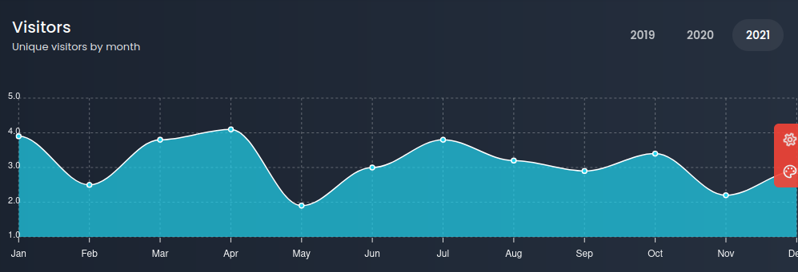

## Document Structure for area trend chart





In this section, you can specify the value of the element's data.
## Basic usage

- Required string param **kind** always should be **area-trend-chart**.
- Required string param **version** is **v1**.
- Required list param **series**, your data list.


```json
{
  "kind": "area-trend-chart",
  "version": "v1",
  "series": [
    1.9,
    3,
    3.4,
    2.2,
    2.9,
    3.9,
    2.5,
    3.8,
    4.1,
    3.8,
    3.2,
    2.9
  ]
}
```


## Set title and subtitle
You can set a title and subtitle for your element.

```json
{
  "kind": "area-trend-chart",
  "version": "v1",
  "title": "Visitors",
  "subtitle": "Unique visitors by month",
  "series": [
    1.9,
    3,
    3.4,
    2.2,
    2.9,
    3.9,
    2.5,
    3.8,
    4.1,
    3.8,
    3.2,
    2.9
  ]
}
```


## Set a Context for Enhanced Chart Interpretation

- The **name** property provides a series name in the chart.
- The **labels** property assigns labels to data points in the chart.
- The **fill** property determines the color filling of the chart elements.
```json
{
  "kind": "area-trend-chart",
  "version": "v1",
  "title": "Visitors",
  "subtitle": "Unique visitors by month",
  "series": {
    "name": "Sales",
    "fill": "#F57170",
    "data": [
      1.9,
      3,
      3.4,
      2.2,
      2.9,
      3.9,
      2.5,
      3.8,
      4.1,
      3.8,
      3.2,
      2.9
    ],
    "labels": [
      "Jan",
      "Feb",
      "Mar",
      "Apr",
      "May",
      "Jun",
      "Jul",
      "Aug",
      "Sept",
      "Oct",
      "Nov",
      "Dec"
    ]
  }
}

```


## In different tabs
Additionally, you can separate your series into different tabs.

```json
{
  "kind": "area-trend-chart",
  "version": "v1",
  "title": "Visitors",
  "subtitle": "Unique visitors by month",
  "series": {
    "2019": {
      "name": "Sales",
      "data": [
        1.9,
        3,
        3.4,
        2.2,
        2.9,
        3.9,
        2.5,
        3.8,
        4.1,
        3.8,
        3.2,
        2.9
      ],
      "labels": [
        "Jan",
        "Feb",
        "Mar",
        "Apr",
        "May",
        "Jun",
        "Aug",
        "Sept",
        "Oct",
        "Nov",
        "Dec"
      ]
    },
    "2020": {
      "name": "Sales",
      "data": [
        2.2,
        2.9,
        3.9,
        2.5,
        3.8,
        3.2,
        2.9,
        1.9,
        3,
        3.4,
        4.1,
        3.8
      ],
      "labels": [
        "Jan",
        "Feb",
        "Mar",
        "Apr",
        "May",
        "Jun",
        "Aug",
        "Sept",
        "Oct",
        "Nov",
        "Dec"
      ]
    },
    "2021": {
      "name": "Sales",
      "data": [
        3.9,
        2.5,
        3.8,
        4.1,
        1.9,
        3,
        3.8,
        3.2,
        2.9,
        3.4,
        2.2,
        2.9
      ],
      "labels": [
        "Jan",
        "Feb",
        "Mar",
        "Apr",
        "May",
        "Jun",
        "Aug",
        "Sept",
        "Oct",
        "Nov",
        "Dec"
      ]
    }
  }
}

```


## Options
All the optional configuration of the chart goes in this property.If you intend to define options for your dashboard, you can refer to [Option](https://apexcharts.com/docs/options/annotations/#) and define your own options accordingly


```json
{
  "kind": "area-trend-chart",
  "version": "v1",
  "title": "Visitors",
  "subtitle": "Unique visitors by month",
  "series": {
    "dataset": [
      {
        "name": "Sales",
        "fill": "#F57170",
        "data": [
          1.9,
          3,
          3.4,
          2.2,
          2.9,
          3.9,
          2.5,
          3.8,
          4.1,
          3.8,
          3.2,
          2.9
        ]
      },
      {
        "name": "Incomes",
        "fill": "#E90064",
        "data": [
          11.9,
          13,
          13.4,
          12.2,
          12.9,
          13.9,
          12.5,
          13.8,
          14.1,
          13.8,
          13.2,
          12.9
        ]
      }
    ],
    "labels": [
      "Jan",
      "Feb",
      "Mar",
      "Apr",
      "May",
      "Jun",
      "Jul",
      "Aug",
      "Sept",
      "Oct",
      "Nov",
      "Dec"
    ]
  },
  "options": {
    "chart": {
      "type": "area",
      "height": "100%",
      "background": "transparent",
      "toolbar": {
        "show": false
      },
      "zoom": {
        "enabled": false
      }
    },
    "theme": {
      "mode": "dark"
    },
    "dataLabels": {
      "enabled": false
    },
    "xaxis": {
      "tooltip": {
        "enabled": false
      },
      "axisBorder": {
        "show": false
      }
    },
    "yaxis": {
      "axisBorder": {
        "show": false
      }
    },
    "markers": {
      "size": 3,
      "strokeWidth": 1.5,
      "strokeOpacity": 1,
      "strokeDashArray": 0,
      "fillOpacity": 1,
      "shape": "circle",
      "radius": 2,
      "hover": {
        "size": 5
      }
    },
    "fill": {
      "type": "solid",
      "opacity": 0.9,
      "gradient": {
        "shadeIntensity": 0.4,
        "opacityFrom": 1,
        "opacityTo": 0.5,
        "stops": [
          30,
          100,
          100
        ]
      }
    },
    "grid": {
      "borderColor": "gray",
      "show": true,
      "strokeDashArray": 3,
      "position": "back",
      "xaxis": {
        "lines": {
          "show": true
        }
      },
      "yaxis": {
        "lines": {
          "show": true
        }
      },
      "padding": {
        "top": 0,
        "right": 0,
        "bottom": 0,
        "left": 0
      }
    },
    "stroke": {
      "show": true,
      "curve": "smooth",
      "lineCap": "butt",
      "width": 1.5,
      "dashArray": 0
    }
  }
}

```
