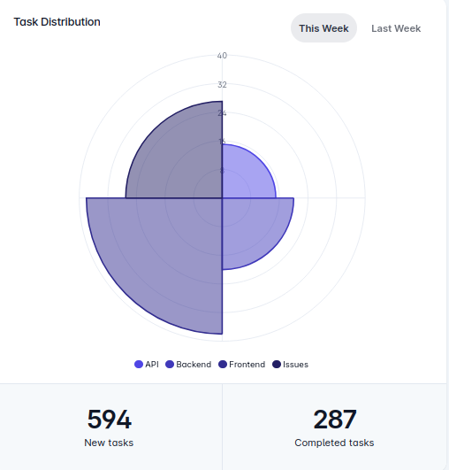

## Document Structure for Task Distribution





In this section, you will find a detailed representation of a JSON object that captures task distribution information through a polar area chart.

## Basic usage

- Required string param **version** is **v1**.
- Required string param **kind** always should be **circular-distribution**.
- Required dictionary param **series**, that holds data.
- Optional string param **title**, chart title for example _Task Distribution_.


```json
{
  "version": "v1",
  "kind": "circular-distribution",
  "series": [
      15,
      20,
      38,
      27
  ]
}
```


### Data Distribution Across different time intervals

You can utilize this structure to analyze how data is distributed across different time intervals and provide the capability for comparison.

```json
{
  "version": "v1",
  "kind": "circular-distribution",
  "series": {
    "Last Week":  [
      15,
      20,
      38,
      27
    ],
    "Last Month":  [
      15,
      20,
      38,
      27
    ]
  }
}
```


### With kpi notes

In addition to the previous modes, you can also define KPI notes.KPI notes consist of three sections: _"pies"_ , _"open"_ and _"closed"_.

```json
{
  "version": "v1",
  "kind": "circular-distribution",
  "series": {
    "Last Week":  {
      "pies": [
        15,
        20,
        38,
        27
      ],
      "open": 564,
      "closed": 212
    },
    "Last Month": {
      "pies": [
        19,
        16,
        42,
        23
      ],
      "open": 564,
      "closed": 212
    }
  }
}
```


### Lable
The label section is optional, but if not provided, it will be automatically generated. 

```json
{
  "pies": [
    "Frontend",
    "Backend",
    "API",
    "Issues"
  ],
  "open": "Tasks Added",
  "closed": "Tasks Completed"
}
```


### options
All the optional configuration of the chart goes in this property.If you intend to define options for your dashboard, you can refer to [Option](https://apexcharts.com/docs/options/annotations/#) and define your own options accordingly

```json
{
  "chart": {
    "height": "100%",
    "type": "polarArea"
  },
  "stroke": {
    "width": 4
  },
  "fill": {
    "type": "solid",
    "opacity": 0.7
  },
  "legend": {
    "position": "bottom"
  },
  "theme": {
    "monochrome": {
      "enabled": true,
      "shadeTo": "light",
      "shadeIntensity": 0.65
    }
  }
}
```

