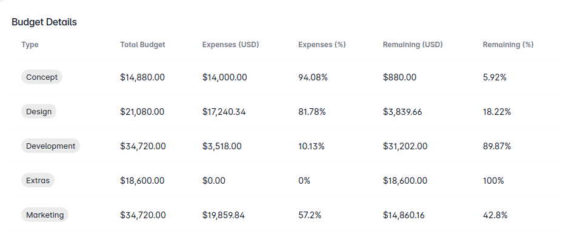

## Document Structure for Creating Data Table





In this section, we intend to explain the data-table element, which provides the capability to display information in a
table format.

### Basic usage

- Required string param **kind** always should be **data-table**.
- Required string param **version** is **v1**.

- **errors** is a dictionary param that allows you to manage situations where there is no data available for
  your `data-table`.
- **columns** is a required list of dictionaries param that filled with your data options.
- **rows** is a required list of dictionaries param that filled with your data.

```json
{
  "kind": "data-table",
  "version": "v1",
  "errors": {
    "no-items-found": "There are no businesses!"
  },
  "columns": [
    {
      "id": "id",
      "align": "center",
      "padding": false,
      "label": "ID",
      "sort": true,
      "type": "integer",
      "className": "p-4 md:p-16 text-center"
    },
    {
      "id": "name",
      "align": "center",
      "padding": false,
      "label": "Name",
      "sort": true,
      "type": "string",
      "className": "p-4 md:p-16 text-center"
    },
    {
      "id": "orders",
      "align": "center",
      "padding": false,
      "label": "Orders",
      "sort": true,
      "type": "integer",
      "className": "p-4 md:p-16 text-center"
    }
  ],
  "rows": [
    {
      "id": 1,
      "name": "Amin",
      "orders": 1250
    },
    {
      "id": 2,
      "name": "Hesam",
      "orders": 1260
    },
    {
      "id": 3,
      "name": "Amir",
      "orders": 1280
    }
  ]
}
```

### Create `one-click-push` Action for `data-table`

This feature allows your users to send a request with the registered attributes as soon as they click on the icon.

- **enum** is a dictionary param that allows you to set and manage icon of your data.
- **icon** is a string param that allows you to set and manage icon of your data, you can choose your preferred icon
  following the structure of [material-icons](https://mui.com/material-ui/material-icons/).
- **className** is a string param that allow you to manage color and size of your icon.
- **title** is a string param that change value of your icon display name.
- **type** is a string param that should be **one-click-push**.

```json
{
  "kind": "data-table",
  "version": "v1",
  "errors": {
    "no-items-found": "There are no businesses!"
  },
  "columns": [
    {
      "id": "id",
      "align": "center",
      "padding": false,
      "label": "ID",
      "sort": true,
      "type": "integer",
      "className": "p-4 md:p-16 text-center"
    },
    {
      "id": "name",
      "align": "center",
      "padding": false,
      "label": "Name",
      "sort": true,
      "type": "string",
      "className": "p-4 md:p-16 text-center"
    },
    {
      "id": "orders",
      "align": "center",
      "padding": false,
      "label": "Orders",
      "sort": true,
      "type": "integer",
      "className": "p-4 md:p-16 text-center"
    },
    {
      "id": "activity",
      "align": "center",
      "padding": false,
      "label": "Activity",
      "sort": false,
      "className": "p-4 md:p-16 text-center",
      "type": "icon",
      "enum": {
        "push": {
          "icon": "check_circle",
          "className": "text-green text-20"
        }
      }
    }
  ],
  "rows": [
    {
      "id": 1,
      "name": "Amir",
      "orders": 1280,
      "activity": {
        "value": "push",
        "click": {
          "title": "push",
          "type": "one-click-push",
          "api": {
            "url": "https://example.com/customer",
            "headers": {},
            "payload": {
              "username": "Amir"
            }
          }
        }
      }
    }
  ]
}
```

### Create `one-click-navigate` Action for `data-table`

This feature gives your users the ability to be instantly redirected to a pre-configured page by simply clicking on the
icon.

- **type** is a string param that should be **one-click-navigate**.

```json
{
  "kind": "data-table",
  "version": "v1",
  "errors": {
    "no-items-found": "There are no businesses!"
  },
  "columns": [
    {
      "id": "id",
      "align": "center",
      "padding": false,
      "label": "ID",
      "sort": true,
      "type": "integer",
      "className": "p-4 md:p-16 text-center"
    },
    {
      "id": "name",
      "align": "center",
      "padding": false,
      "label": "Name",
      "sort": true,
      "type": "string",
      "className": "p-4 md:p-16 text-center"
    },
    {
      "id": "orders",
      "align": "center",
      "padding": false,
      "label": "Orders",
      "sort": true,
      "type": "integer",
      "className": "p-4 md:p-16 text-center"
    },
    {
      "id": "activity",
      "align": "center",
      "padding": false,
      "label": "Activity",
      "sort": false,
      "className": "p-4 md:p-16 text-center",
      "type": "icon",
      "enum": {
        "navigate": {
          "icon": "check_circle",
          "className": "text-green text-20"
        }
      }
    }
  ],
  "rows": [
    {
      "id": 2,
      "name": "Hesam",
      "orders": 1260,
      "activity": {
        "value": "navigate",
        "click": {
          "title": "navigate",
          "type": "one-click-navigate",
          "api": {
            "url": "https://example.com/api/customer",
            "headers": {},
            "payload": {
              "username": "Hesam"
            }
          }
        }
      }
    }
  ]
}
```


### Create `edit-form-action` Action for `data-table`

This feature enables your users to, upon clicking the icon, immediately view an edit form related to the selected row
and be able to make edits.

- **type** is a string param that should be **edit-form**.
- **buttons** is a list of dictionaries that allow you to add buttons for your `edit-form-action`.

```json
{
  "kind": "data-table",
  "version": "v1",
  "errors": {
    "no-items-found": "There are no businesses!"
  },
  "columns": [
    {
      "id": "id",
      "align": "center",
      "padding": false,
      "label": "ID",
      "sort": true,
      "type": "integer",
      "className": "p-4 md:p-16 text-center"
    },
    {
      "id": "name",
      "align": "center",
      "padding": false,
      "label": "Name",
      "sort": true,
      "type": "string",
      "className": "p-4 md:p-16 text-center"
    },
    {
      "id": "orders",
      "align": "center",
      "padding": false,
      "label": "Orders",
      "sort": true,
      "type": "integer",
      "className": "p-4 md:p-16 text-center"
    },
    {
      "id": "activity",
      "align": "center",
      "padding": false,
      "label": "Activity",
      "sort": false,
      "className": "p-4 md:p-16 text-center",
      "type": "icon",
      "enum": {
        "edit": {
          "icon": "edit",
          "className": "text-yellow text-20"
        }
      }
    }
  ],
  "rows": [
    {
      "id": 1,
      "name": "Amin",
      "orders": 1250,
      "activity": {
        "value": "edit",
        "click": {
          "id": "transaction-edit-form",
          "title": "Transaction editing",
          "type": "edit-form",
          "fields": [
            {
              "kind": "text-field",
              "version": "v1",
              "name": "number_of_production",
              "label": "Number of production",
              "defaultValue": "{{row.number_production_of_number}}"
            }
          ],
          "buttons": [
            {
              "title": "Send",
              "for_dirty": false,
              "api": {
                "url": "https://example.com/api/edit_business",
                "headers": {},
                "payload": {}
              }
            }
          ]
        }
      }
    }
  ]
}
```

### Complex Example 

```json
{
  "kind": "data-table",
  "version": "v1",
  "errors": {
    "no-items-found": "There are no businesses!"
  },
  "columns": [
    {
      "id": "id",
      "align": "center",
      "padding": false,
      "label": "ID",
      "sort": true,
      "type": "integer",
      "className": "p-4 md:p-16 text-center"
    },
    {
      "id": "name",
      "align": "center",
      "padding": false,
      "label": "Name",
      "sort": true,
      "type": "string",
      "className": "p-4 md:p-16 text-center"
    },
    {
      "id": "orders",
      "align": "center",
      "padding": false,
      "label": "Orders",
      "sort": true,
      "type": "integer",
      "className": "p-4 md:p-16 text-center"
    },
    {
      "id": "activity",
      "align": "center",
      "padding": false,
      "label": "Activity",
      "sort": false,
      "className": "p-4 md:p-16 text-center",
      "type": "icon",
      "enum": {
        "edit": {
          "icon": "edit",
          "className": "text-yellow text-20"
        },
        "navigate": {
          "icon": "check_circle",
          "className": "text-green text-20"
        },
        "push": {
          "icon": "check_circle",
          "className": "text-green text-20"
        }
      }
    }
  ],
  "rows": [
    {
      "id": 1,
      "name": "Amin",
      "orders": 1250,
      "activity": {
        "value": "edit",
        "click": {
          "id": "transaction-edit-form",
          "title": "Transaction editing",
          "type": "edit-form",
          "fields": [
            {
              "kind": "text-field",
              "version": "v1",
              "name": "number_of_production",
              "label": "Number of production",
              "defaultValue": "{{row.number_of_production}}"
            }
          ],
          "buttons": [
            {
              "title": "Send",
              "for_dirty": false,
              "api": {
                "url": "https://example.com/api/edit_business",
                "headers": {},
                "payload": {}
              }
            }
          ]
        }
      }
    },
    {
      "id": 2,
      "name": "Hesam",
      "orders": 1260,
      "activity": {
        "value": "navigate",
        "click": {
          "title": "navigate",
          "type": "one-click-navigate",
          "api": {
            "headers": {},
            "url": "https://example.com/api/customer",
            "payload": {
              "username": "Hesam"
            }
          }
        }
      }
    },
    {
      "id": 3,
      "name": "Amir",
      "orders": 1280,
      "activity": {
        "value": "push",
        "click": {
          "title": "push",
          "type": "one-click-push",
          "api": {
            "headers": {},
            "url": "https://example.com/api/customer",
            "payload": {
              "username": "Amir"
            }
          }
        }
      }
    }
  ]
}
```
