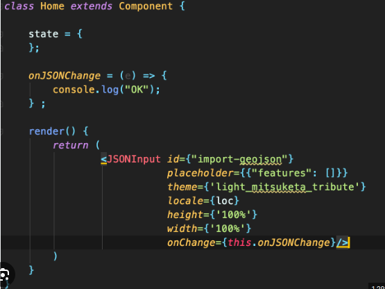

## Document Structure for Creating JSON Editor





In this section, you will become familiar with a tool that provides you with the capability to edit code using the JSON
format through a form.

## Basic usage

- Required string param **kind** always should be **code-editor-json**.
- Required string param **version** always should be **v1**.
- Required string param **name** data key for this field's payloads.
- Required integer param **height** a numerical value used to set the height of your form's display.

Incorporate this information into the provided template to create a well-structured element relevant to editing
JSON-formatted forms.

```json
{
  "kind": "code-editor-json",
  "version": "v1",
  "name": "JsonEditor",
  "height": 288
}
```


## Set placeholder

- **placeholder** is a dictionary param for set `placeholder`.

```json
{
  "kind": "code-editor-json",
  "version": "v1",
  "name": "JsonEditor",
  "placeholder": {
    "example": {
      "my customer name": "Tom"
    }
  },
  "height": 288
}
```
