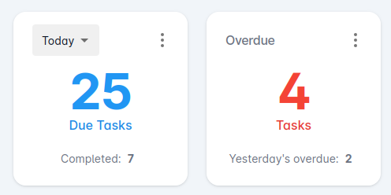

## Document Structure for sticky target




In this section, you can specify the value of the element's data.
## Basic usage

- Required string param **version** is **v1**.
- Required string param **kind** always should be **sticky-target**.
- Required string param **name**, your target name.
- Required integer param **count**, your target amount.

```json
{
  "version": "v1",
  "kind": "sticky-target",
  "data": {
    "name": "Due Tasks",
    "count": 21
  }
}

```

### Set color

You can also set your preferred color and/or set a note for your elements.
```json
{
  "version": "v1",
  "kind": "sticky-target",
  "color": "#f44336",
  "data": {
    "name": "Due Tasks",
    "note": "7 Completed",
    "count": 21
  }
}
```


### In different tabs

Additionally, you can separate your data into different tabs.
```json
{
  "version": "v1",
  "kind": "sticky-target",
  "color": "#ff9800",
  "data": {
    "Yesterday": {
      "name": "Due Tasks",
      "note": "7 Completed",
      "count": 21
    },
    "Last Week": {
      "name": "Due Tasks",
      "note": "76 Completed",
      "count": 80
    },
    "Last Month": {
      "name": "Due Tasks",
      "note": "200 Completed",
      "count": 250
    }
  }
}

```


### Add more information
You can provide more information about your element in this section and link it to a specific URL if desired.

you can choose your preferred icon following the structure of [material-icons](https://mui.com/material-ui/material-icons/).
```json
{
  "version": "v1",
  "kind": "sticky-target",
  "color": "#4caf50",
  "data": {
    "Yesterday": {
      "name": "Due Tasks",
      "note": "7 Completed",
      "count": 21
    }
  },
  "more": {
    "icon": "create",
    "click": {
      "url": "example.com",
      "headers": {},
      "path": "/kpi/create",
      "payload": {}
    }
  }
}

```

